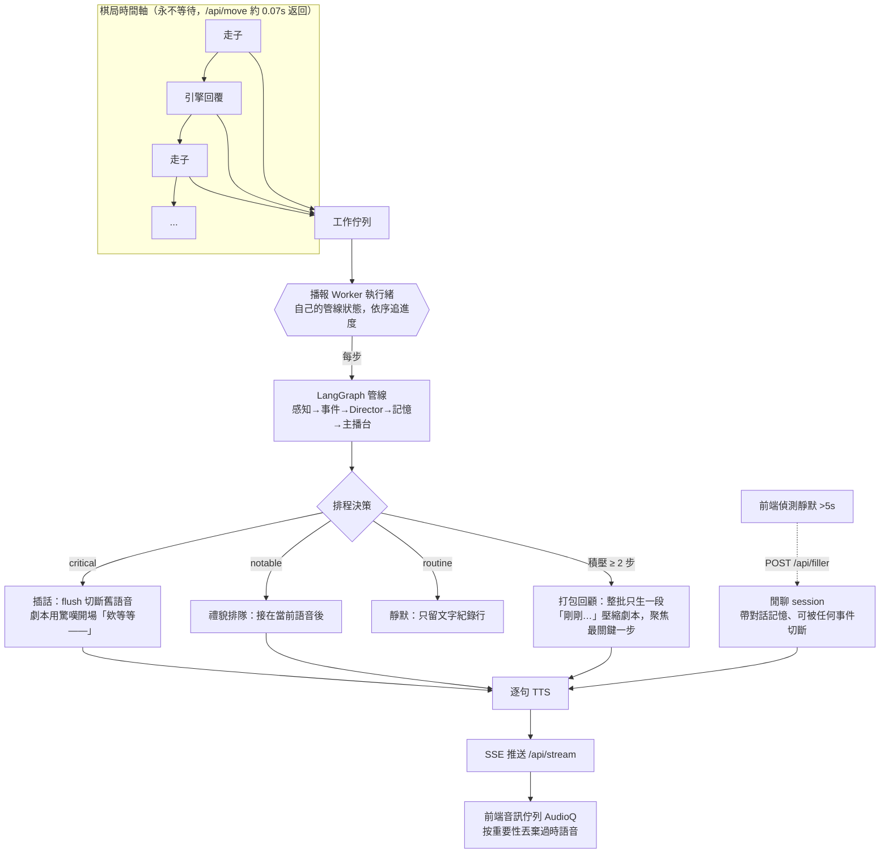
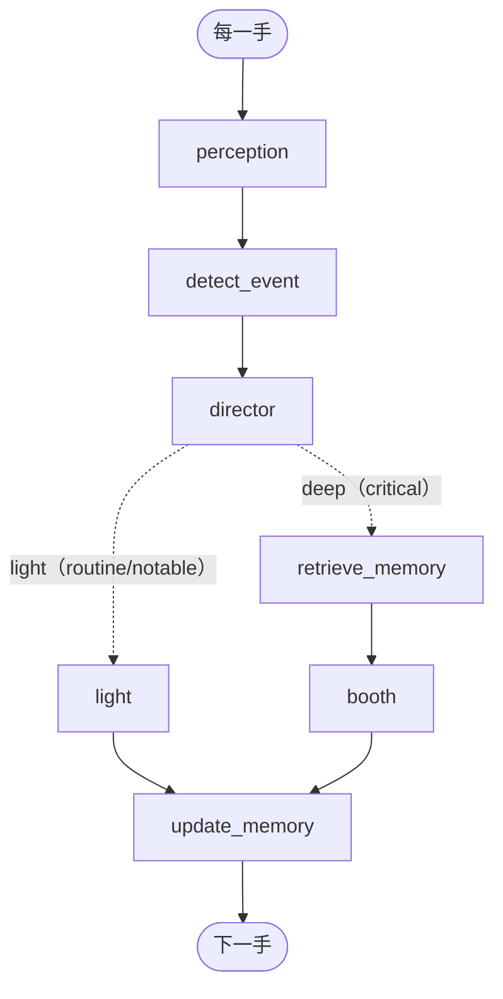

# Agentic 西洋棋即時主播 — 初版

會判斷何時該激動、何時該閉嘴、所有棋理都有引擎背書的多主播台。
完整設計見 `chess_broadcaster_spec.md`。

## 這個初版做到什麼（M0–M2）

- ✅ 盤面感知（python-chess）+ Stockfish 評估 + **落子前後評估差**
- ✅ 事件偵測 + 嚴重度（check / mate / capture / blunder / sacrifice / fork / 進殘局…）
- ✅ **Director 動態路由**（light / deep）+ 由嚴重度推導的情緒 register ← 核心
- ✅ 接地播報（FactsPacket，主播只能複述事實）
- ✅ routine 步**自動靜默**
- ✅ 三種 persona 風格皮
- ✅ Streamlit 介面（棋盤、評估、逐步播報）
- ✅ **離線可跑**：沒有 Stockfish / 沒有 API key 時，用 mock 引擎 + 接地模板代打

## 還沒做（接下來照 spec 補）

- ✅ **真 LLM 播報**（OpenAI gpt-4o / gpt-4o-mini，見 `graph/nodes/booth.py`）
- ✅ Stockfish 真引擎（設好 `.env` 的 `STOCKFISH_PATH` 即自動切換；門檻已用真實棋局校過，驗證工具見 `tools/severity_report.py`）
- ✅ ChromaDB 分層記憶第 2 層（棋理檢索，語料在 `memory/theory_seed.py`；沒裝 chromadb 時自動退回關鍵字比對）
- ✅ 三層消融 harness（`tools/ablation.py`，baseline / rag / full 對照＋盲評，報告在 `eval_out/`）
- ✅ LangGraph 化（裝了 `langgraph` 自動走圖，沒裝退回 sequential；Director 路由是圖上真正的 conditional edge）
- ✅ TTS 語音（`tts.py`；Fish Audio 為主（三種 persona 各配一組台灣腔聲音對，語速/temperature
  跟著 register 強度走），失敗或沒 key 時退回 edge-tts（本地/免費），永不啞掉）
- ✅ 對弈模式 Web 版「棋訊直播間」（FastAPI + 自訂前端，見下節）
- ✅ **排程式非同步播報**：走子 0.07s 返回、SSE 逐句推送、critical 插話、
  積壓打包成「剛剛…」回顧、過時語音按重要性丟棄（見下節架構圖）
- ✅ **對話式雙主播**：一次生成接話劇本（podcast 式），閒聊 session 帶記憶、
  冷場自動填補、可被任何真實事件切斷
- ✅ **賽後收官播報**：將殺／逼和／和棋時，兩位主播用整場 `said_so_far` 關鍵時刻
  做一段簡短總結收尾（`generate_closing`），不是只停在最後一步
- ✅ **棋盤外框座標**：a–h／1–8 跟著 orientation 走，王車易位／過路兵等多格移動
  的高亮也一併修正（原本只標國王移動的那兩格）
- ✅ **修掉 Stockfish 併發崩潰**：即時對局的引擎選棋 + 播報 worker 的逐步分析
  原本共用一條 Stockfish 連線，兩邊搶著送指令會讓對方的分析被取消（引擎因此
  常常「不下棋」）；現在拆成兩條獨立連線，並在 `StockfishClient` 內加鎖保護
- ⬜ 投機準備（對手思考時預生成候選步反應，Phase D）
- ⬜ 棋手風格檔（分層記憶第 3 層，stretch）

## 對弈模式：棋訊直播間（feature/human-play）

自己下棋、讓主播台**像真人搭檔一樣**實況解說你的對局。FastAPI 後端＋自訂深色直播間前端：

```bash
pip install fastapi uvicorn
uvicorn server:app
# 開 http://localhost:8000
```

### 🎙️ 播報架構：排程式非同步主播台（亮點）

傳統做法是「走一步 → 等引擎 → 等 LLM → 等 TTS → 才能走下一步」，一步卡幾十秒，
真實棋局不可能等你。我們把**棋局時間軸**和**播報時間軸**徹底分離，
播報用「**排程**」的方式追棋局，就像真人賽評：講得完就講、講不完就壓縮、
大事件直接插話、沒事的時候閒聊。



**排程策略總表**（`server.py` worker + `web/index.html` AudioQ）：

| 情境 | 行為 |
|---|---|
| critical 事件 | 生成 3–5 句對話劇本；第一句帶 `flush=true`，前端**切斷正在播的語音直接插話**，開場刻意寫成打斷語氣 |
| notable 事件 | 一句短評，排在當前語音後面播（不打斷） |
| routine 步 | 完全靜默，只在文字流留一行紀錄（空檔交給閒聊） |
| worker 積壓 ≥ 2 步 | **打包回顧**：整批棋每步照跑分析（評估/事件/記憶不跳），但只生一段「剛剛…」口吻的壓縮劇本，自動挑嚴重度最高（同級比 \|Δcp\|）的一步當主角，其他一句帶過 |
| 音訊過時 | 前端按重要性修剪未播的語音：閒聊有新棋就丟、routine 容忍 1 步、notable 容忍 2 步、**critical 永不丟**；文字卡片一律保留 |
| 靜默 > 5 秒 | 前端觸發閒聊；最後一句閒聊還在播時就**預先要下一批**，接得無縫 |

### 💬 兩人閒聊是怎麼做的

模仿 AI podcast（如 NotebookLM）的做法——**先寫對話稿、再逐句配音**，
而不是讓兩個角色各自獨白：

1. **對話劇本生成**（`graph/nodes/booth.py::_dialogue_generate`）：
   一次 LLM call 產出 JSON 劇本 `[{speaker, text}, ...]`，prompt 要求
   「兩人交替、每句 15–40 字、後一句接前一句的話尾、可附和可反問、可加語助詞」。
   主播（play_by_play）拋鉤子、分析師（analyst）接話解釋，強度 ≥0.8 時
   第一句強制用打斷式驚嘆開場
2. **接地鐵則不變**：劇本只能引用 FactsPacket 裡的事實（引擎評估、事件、
   記憶回扣、棋理檢索），不可捏造
3. **逐句 TTS**（`tts.py`）：Fish Audio 為主（三種 persona 各配一組台灣腔聲音對，
   `config.FISHAUDIO_VOICES`），沒 key 或呼叫失敗時退回 edge-tts；
   每句的語速／temperature 由 persona + Director 的 register 強度共同推導——
   平靜旁白 → 專業起伏 → 情緒沸騰三檔。多句劇本會平行送出合成請求
   （`_speak_stream`），逐句就緒逐句推送，不用等最慢那句
4. **閒聊有記憶**（`generate_filler` + worker 的 `chat_log`）：
   每批閒聊都帶著「剛才聊過什麼」（含正式播報的內容）去生成，
   指示「接著聊、不重複、可換角度」；素材只用真實資料——最近棋步、
   評估、multipv 候選步（「接下來可能走…」）、本局關鍵時刻回扣

逐句（utterance）是整個系統的原子單位：插話的顆粒度、過時丟棄的顆粒度、
兩人交替的節奏，都建立在「短句」上。

### 介面

- 點選棋子走棋：可動的棋子滑鼠移過會亮、選中會「拿起來」、
  可走格顯示圓點／可吃子顯示圓環（Lichess 風格）
- 走子是滑動動畫、吃子淡出，**零閃爍**（棋盤是 DOM 原地更新，不重新載入）
- 棋盤色調可切換：**石墨**（預設）／胡桃木／翡翠／海洋，
  走棋高亮顏色跟著主題配色，偏好會記住
- 左側評估條即時升降（評估由 SSE 非同步推送）；棋譜收合成按鈕；
  對局結束顯示結果幕（將殺／和棋）
- 語音播報永遠開啟（沒 API key 自動退化成純文字），設定即時生效不用重開局

### API

| Endpoint | 說明 |
|---|---|
| `POST /api/new` | 開新局（對手/執色/深度/主播風格） |
| `POST /api/move` | 走棋，**立即**回傳新局面（不等播報） |
| `GET /api/stream` | SSE 事件流：`utterance`（逐句播報＋語音 base64＋ply）、`eval`、`reset` |
| `POST /api/filler` | 前端回報冷場，觸發閒聊（worker 忙碌時自動略過） |
| `POST /api/opts` | 即時改設定（風格/深度） |
| `GET /api/state` / `GET /api/pieces` | 完整快照（重新整理用）／棋子 SVG |

（舊版 Streamlit 介面仍在：`streamlit run play.py`）

## 架構（LangGraph）



`director` 的分流是 `add_conditional_edges`——這是整個系統的 agentic 核心：例行步走便宜的 `light`（多半靜默），關鍵步才觸發 `retrieve_memory`（ChromaDB 棋理 + 本局回扣）與雙主播 `booth`。

## 快速開始

### 1) 安裝依賴

```bash
pip install -r requirements.txt
# 或是只裝必要的：
pip install python-chess streamlit langchain-openai langchain python-dotenv
```

### 2) 建立 .env 設定檔

在專案根目錄建一個 `.env`（此檔不會被 git 追蹤，請勿 commit）：

```
OPENAI_API_KEY=sk-proj-你的key填這裡

# 下載 Stockfish 後把路徑填進來（不填就用 mock 引擎）
# STOCKFISH_PATH=/path/to/stockfish

# TTS 語音（選填）：不填就退回 edge-tts（本地/免費，不需要 key）
# 去 https://fish.audio 申請，兩個字都要大寫的 KEY 名稱
FISHAUDIO_API_KEY=你的fish-audio-key填這裡
```

> **注意**：API key 請從對應平台的官網取得（OpenAI: https://platform.openai.com/api-keys ；
> Fish Audio: https://fish.audio），不要貼在程式碼或 git 裡。

### 3) Phase 0 — 離線跑通（不需要 Stockfish 或 API key）

```bash
# 命令列跑內建 demo（用 mock 引擎，看路由判定是否合理）
python3 demo_cli.py
# 預期輸出：
#   [routine |light] … (silent)
#   [critical|deep ] (play_by_play) 6. Nxf7 （capture、sacrifice）…
#   [notable |light] (play_by_play) 7. Qf3+ 將軍！…

# Streamlit 介面
streamlit run app.py
# 開瀏覽器 http://localhost:8501，按「▶ 下一步」逐步播報
```

### 4) Phase 1 — 接真引擎（讓評估數字有意義）

```bash
# 下載 Stockfish binary：https://stockfishchess.org/download/
# Linux/WSL 範例：
wget https://github.com/official-stockfish/Stockfish/releases/latest/download/stockfish-ubuntu-x86-64.tar
tar xf stockfish-ubuntu-x86-64.tar

# 把路徑加進 .env
# STOCKFISH_PATH=/path/to/stockfish

python3 demo_cli.py   # 評估數字變正常，開始調 config.py 門檻
```

### 5) Phase 3 — 接真 LLM 播報（已完成）

把 `OPENAI_API_KEY` 填進 `.env` 後直接跑，系統自動偵測並切換：

```bash
python3 demo_cli.py   # critical/deep 步驟自動用 GPT 生成播報
```

> 使用 `gpt-4o-mini`（light 路徑）和 `gpt-4o`（deep 路徑）。
> 模型名稱在 `config.py` 的 `LIGHT_MODEL` / `DEEP_MODEL` 調整。

## 結構

```
config.py                  # 門檻、模型、Stockfish 路徑、TTS 聲音設定（最常調的就是嚴重度門檻）
                           #   （FISHAUDIO_VOICES：三種 persona 各一組台灣腔聲音對，
                           #     reference_id 從 fish.audio 的 /m/<hex>/ 網址取得）
pipeline.py                # 初版的循序驅動（process_move / run_game）
demo_cli.py / app.py       # CLI 與 Streamlit 重播入口
server.py                  # 對弈模式後端：FastAPI + 播報 worker 執行緒 + SSE 推送
                           #   （排程決策：插話/排隊/靜默/打包回顧 都在 worker 裡）
web/index.html             # 棋訊直播間前端（單檔 HTML/CSS/JS）
                           #   （AudioQ 音訊佇列：flush 插話、按重要性丟過時語音、冷場觸發閒聊）
play.py                    # 對弈模式舊版（Streamlit）
tts.py                     # Fish Audio 為主、edge-tts 為備援（per-persona 聲音對、register 語氣）
engine/stockfish_client.py # UCI 封裝（含 mock fallback）
engine/chess_utils.py      # material、phase、fork、en-prise
graph/state.py             # 資料結構
graph/nodes/               # perception / event_detector / director / memory / booth
                           #   （booth：對話劇本 _dialogue_generate、閒聊 generate_filler、
                           #     回顧 generate_recap）
graph/build_graph.py       # LangGraph 版（M2+ 切換用）
personas/personas.py       # 三種風格 + 接地鐵則
tools/                     # severity_report（門檻校準）、ablation（消融實驗）
```

## 最先該調的東西

`config.py` 的嚴重度門檻（`DELTA_CRITICAL` 等）。太鬆 → 每步都進 deep、變慢；太緊 → 冷場。
先跑 `demo_cli.py` 看判定合不合理，再微調。
